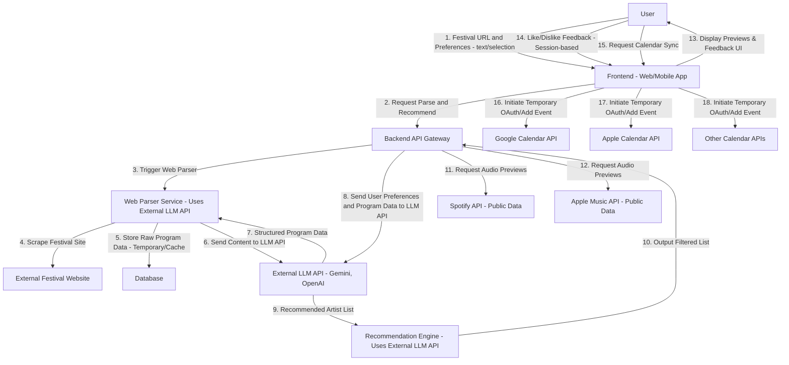

# Music Festival Discovery Service Architecture
This architecture focuses on leveraging existing AI services and a stateless approach for user personalization, making the service simpler to implement and maintain, particularly for initial deployment.

## 1. Frontend (User Interface)
This is the client-facing application.

Technologies: Simple React (minimum dependencies) + Tailwind CSS for styling.

Deployment: Vercel is an excellent choice for hosting the frontend application, providing seamless deployment for React apps and efficient content delivery.

Key Responsibilities:

- **Input**: Allow users to paste or type a festival website URL and explicitly provide their music preferences (e.g., "funky jazz, minimal electronic, authentic sound, live bands" or a selection of genres/artists). Optionally, users can authorize access to their Spotify or Apple Music accounts, allowing the app to fetch their music preferences directly from these services via their APIs.

- **Display**: Render the parsed festival program, recommended artist lists, and audio previews (Spotify/Apple Music widgets).

- **Interactivity**: Handle user feedback (like/dislike buttons). This feedback would be session-based, refining recommendations within the current session but not persistently stored.

- **Calendar Integration**: Trigger temporary OAuth flows for direct calendar event creation, without storing persistent access tokens.

## 2. Backend API Gateway
This acts as the central hub, orchestrating calls to external LLM APIs and music services.

Technologies: Next.js / Vercel.

Key Responsibilities:

- **Request Routing**: Directs requests to internal services.

- **Orchestration**: Manages the flow of data between the Frontend, Web Parser, Recommendation Engine, and external music APIs.

- **API Key Management**: Securely handles the API keys for the External LLM API.

- **Temporary Data Handling**: May temporarily hold parsed program data in-memory or in a short-lived cache for the duration of a session if not persisting to Firestore.

## 3. Data Storage (Firestore)
In this simplified model, Firestore would primarily store non-personalized, frequently accessed data or act as a temporary cache.

Collections (Examples):

- `festivals`: Could store cached parsed program data for a specific festival URL to avoid re-parsing on every request, but this would be transient and not tied to a user.

- `artists`: Canonical artist information (name, genres, external music IDs) could still be stored here to serve as a lookup table and reduce repeated calls to music APIs for common artists.

- `parsing_jobs`: To track the status of current website parsing tasks.

## 4. Web Parser Service (Uses External LLM API)
This service focuses on extracting and structuring festival program data using an external LLM.

### External LLM Integration:

- The service would take the festival website's HTML content (fetched via a simple HTTP request, or potentially by browsing the site if the LLM has that capability) and send it to an External LLM API (e.g., Gemini API, OpenAI's GPT-4o with vision) with a prompt instructing it to extract artist names, stages, dates, and times into a structured format (e.g., JSON schema).

- The LLM's natural language understanding and ability to follow instructions on structured output are key here.

- Output: Structured JSON data of the festival program. This can be returned directly to the Backend API for immediate use or temporarily cached in Firestore.

## 5. Recommendation Engine (Uses External LLM API)
The core intelligence for matching users to artists, now fully powered by an external LLM.

### External LLM Integration:

- This service receives the user's explicit preferences (e.g., "funky jazz, minimal electronic") and the parsed festival program data. If the user has authorized access to their Spotify or Apple Music account, the service can also retrieve and use their actual listening history or top genres/artists from these APIs to further personalize recommendations.

- It then sends a prompt to the External LLM API asking it to filter and rank artists from the program based on the provided preferences and/or fetched music profile. The LLM's vast knowledge base of music genres and artists would be utilized for this task.

- Example Prompt Concept: "Given this list of artists and their known genres from a festival program, and a user who likes [user preferences or Spotify/Apple profile], recommend the top 10 artists, explaining why each is recommended. Format the output as JSON."

- Output: A filtered and ranked list of recommended artists, potentially with a brief explanation for each.

## 6. External Music Service Integrations (Spotify, Apple Music)
- APIs are used to fetch user's music preferences (if the user authorizes access).
- APIs are used for retrieving public artist/track data for audio previews.

APIs: Spotify Web API, Apple Music API.

### Usage:

- User Profile Fetch: If authorized, fetch the user's top artists, genres, or tracks from Spotify/Apple Music to use as input for the recommendation engine.

- Artist Lookup: Used to find canonical artist IDs and retrieve track information for generating audio previews.

- Audio Previews: Generate embeddable widgets or direct audio URLs.

- No User Data Access Without Consent: User listening history or preferences are only accessed if the user explicitly authorizes via OAuth. Otherwise, only explicit preferences provided in the session are used.

## 7. Calendar Sync Service
This service handles the one-time integration with user calendars.

APIs: Google Calendar API, Apple Calendar API, Microsoft Outlook Calendar API.

### Key Responsibilities:

- Temporary OAuth 2.0 Flow: The frontend would initiate a temporary OAuth flow directly with the user's chosen calendar service (or via a very short-lived backend proxy) to get permission for the current action only. No refresh tokens are stored.

- Event Creation: Constructs calendar events with all relevant details (artist, stage, time, location) and pushes them to the user's calendar.

#### Communication Flow (Simplified)
- User Enters URL & Preferences: Frontend sends the festival URL and user's explicit preferences to the Backend API.

#### Backend Orchestration:

- Backend triggers the Web Parser Service.

- Web Parser fetches HTML, sends it to the External LLM API for parsing into structured program data.

- Web Parser returns the structured data to the Backend (which might temporarily cache it).

- Backend sends the user's preferences and the structured program data to the External LLM API for recommendations.

- The LLM returns the recommended artist list to the Backend.

#### Frontend Display: Backend sends the recommended artist list to the Frontend.

- Audio Previews: Frontend requests audio preview widgets directly from Spotify/Apple Music APIs using artist IDs provided by the Backend.

- User Feedback: User feedback (like/dislike) is handled locally by the Frontend to refine the current session's display. It is not sent to the Backend for persistent storage or preference updates.

- Calendar Sync: User selects artists for sync. Frontend initiates a temporary OAuth directly with the calendar provider, then creates the events.

## Key Considerations & Challenges in Model
- Prompt Engineering: The quality of recommendations and parsing will heavily depend on well-crafted prompts to the External LLM API. This requires iterative testing and refinement.

- LLM API Costs & Rate Limits: Consider the cost per token and rate limits of the chosen LLM API, as parsing and recommendations will involve multiple API calls.

- LLM Hallucinations/Accuracy: LLMs can sometimes "hallucinate" or misinterpret content. Robust error handling and user feedback mechanisms will be important.

- Stateless Personalization: Without storing user data, personalization is limited to the explicit input provided in the current session. The system won't "learn" over time about a specific user's evolving tastes.

- Real-time Parsing: For very large festival sites, parsing the entire program via an LLM on every request might be slow. Caching the parsed data (even if non-personalized) is highly recommended.

- Website Variability: While LLMs are good at understanding varied text, highly unstructured or visually complex websites might still pose challenges for extraction.

- API Keys: Ensure secure handling of the LLM API key on the backend.

- Vercel Deployment: Leveraging Vercel for both frontend and backend (via serverless functions) offers a streamlined development and deployment experience, with automatic scaling and easy CI/CD integration.

This architecture reduces the need for complex internal AI model management and persistent data storage, making it a faster path to a working prototype.
